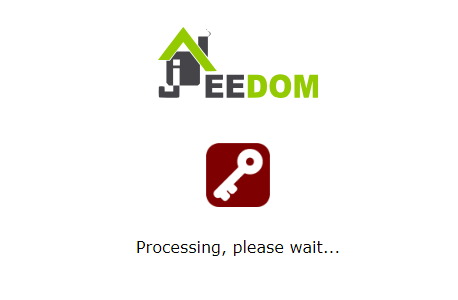

Plugin AutoLogin (autologin)
=============================

Plugin pour se connecter automatiquement à Jeedom avec un utilisateur choisi restreint à une IP.

**Cas d'utilisation :**
- Ecrans déportés (tablettes)
- Difffusion Jeedom sur GoogleCast (voir plugin googlecast)

**Fonctionnement :**

Une page spécifique devra être appelé par le navigateur et gérera l'authentification automatique puis redirigera sur l'URL Jeedom.

> **Note**    
> L'utilisateur du plugin prend la responsabilité de fournir un accès à Jeedom de manière simplifié (sans mot de passe)

Dashboard
=======================

Pas de panneau disponible sur le dashboard

Configuration du plugin
=======================

Activer seulement le plugin.

Configuration des équipements
=============================

La configuration des sessions Autologin est accessible à partir du menu *Plugins > Programmation > AutoLogin*.

Liste des paramêtres :

- IP autorisée à partir duquel l'équipement devra se connecter: 
  - Adresse IP (ex: 127.0.0.1)
  - Hostname
  - Variable (ex: variable(ip))
- Utilisateur : Choisir un utilisateur non admin (il est nécessaire d'avoir créé un utilisateur non admin au préalable)
- Page Jeedom : La page Jeedom de redirection une fois l'autologin effectué (sans le *http[s]://jeedom/*).    
Exemple : "*index.php*" ou "*index.php?v=d&p=plan&plan_id=1*"

URL à appeler : Le lien à appeler qui gérera l'authentification et redirigera sur la page Jeedom choisie après 2 secondes.
Selon le besoin utiliser l'url interne ou externe.

> **Example**
>
> Utiliser le lien fournit par le plugin dans le navigateur de l'équipement ayant la même IP que celle renseignée :
``https://myjeedom/plugins/autologin/core/php/go.php?apikey=mypluginapikey&id=187``
>
> Si le navigateur n'est pas déjà authentifié avec l'utilisateur choisi, le lien de la page Jeedom renseignée va se charger après 2 secondes. Dans le cas contraire, la page sera redirigée directement.

> **Note**
>
> Pour forcer la ré-authentification, il est possible d'ajouter l'option *&force* à la fin de l'URL
``https://myjeedom/plugins/autologin/core/php/go.php?apikey=mypluginapikey&id=187&force``
>

Sécurité
=======================

Il est vivement recommandé de créer un utilisateur dédié pour une utilisation sans login.

Pour une utilisation en local, il est également recommandé d'activer l'option 'Local' pour cet utilisateur.

En cas de faille, il est possible de désactiver l'utilisateur et/ou régénerer une clé API pour le plugin.

FAQ
=============================

Changelog
=============================

[Voir la page dédiée](changelog.md).
